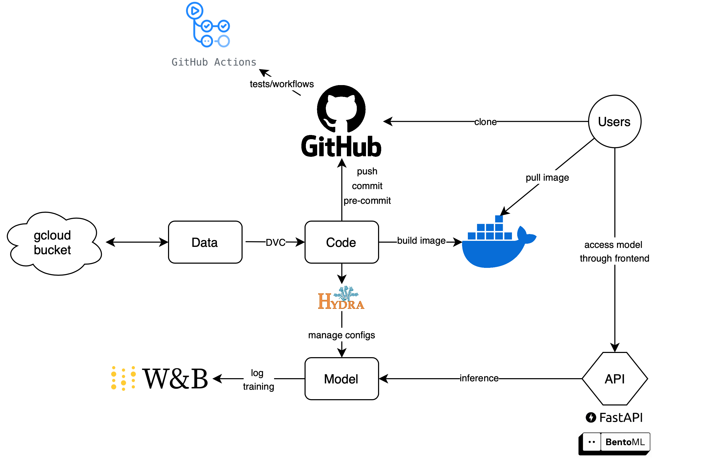

# Welcome to `pet_fac_rec`

## Overview
Welcome to the documentation for `pet_fac_rec`, a machine learning project for pet facial recognition. This documentation provides details on the following:
- Project architecture
- Data preprocessing
- Model design and performance

---

## Project Architecture

The following diagram illustrates the architecture of the project:

---

## Key Features
- **Data Handling**: Manages the datasets for training and validation.
- **Model Training**: Supports multiple deep learning models like EfficientNet, ResNet, and VGG. EfficientNet is the main model that is used.
- **Visualization**: Visualizes training and testing losses and accuracies.

---

## Navigation
- **[Data](data.md)**: Learn more about the dataset and preprocessing steps.
- **[Model](model.md)**: Explore the model details and training process.
- **[Visualization](visualization.md)**: Visualize the training progress and results.
