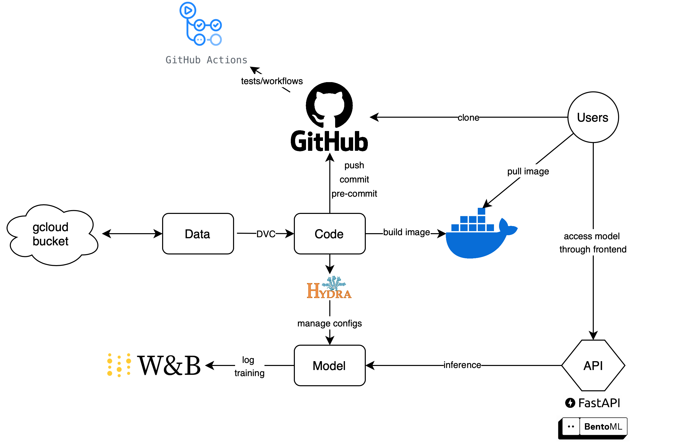

# Exam template for 02476 Machine Learning Operations

This is the report template for the exam. Please only remove the text formatted as with three dashes in front and behind

like:

`--- question 1 fill here ---`

Where you instead should add your answers. Any other changes may have unwanted consequences when your report is

auto-generated at the end of the course. For questions where you are asked to include images, start by adding the image

to the `figures` subfolder (please only use `.png`, `.jpg` or `.jpeg`) and then add the following code in your answer:

```markdown

```

In addition to this markdown file, we also provide the `report.py` script that provides two utility functions:

Running:

```bash

python  report.py  html

```

Will generate a `.html` page of your report. After the deadline for answering this template, we will auto-scrape everything in this `reports` folder and then use this utility to generate a `.html` page that will be your serve as your final hand-in.

Running

```bash

python  report.py  check

```

Will check your answers in this template against the constraints listed for each question e.g. is your answer too short, too long, or have you included an image when asked. For both functions to work you mustn't rename anything.

The script has two dependencies that can be installed with

```bash

pip  install  typer  markdown

```

## Overall project checklist

The checklist is _exhaustive_ which means that it includes everything that you could do on the project included in the curriculum in this course. Therefore, we do not expect at all that you have checked all boxes at the end of the project.

The parenthesis at the end indicates what module the bullet point is related to. Please be honest in your answers, we will check the repositories and the code to verify your answers.

### Week 1

- [x] Create a git repository (M5)

- [x] Make sure that all team members have write access to the GitHub repository (M5)

- [x] Create a dedicated environment for you project to keep track of your packages (M2)

- [x] Create the initial file structure using cookiecutter with an appropriate template (M6)

- [x] Fill out the `data.py` file such that it downloads whatever data you need and preprocesses it (if necessary) (M6)

- [ ] Add a model to `model.py` and a training procedure to `train.py` and get that running (M6)

- [ ] Remember to fill out the `requirements.txt` and `requirements_dev.txt` file with whatever dependencies that you

are using (M2+M6)

- [x] Remember to comply with good coding practices (`pep8`) while doing the project (M7)

- [ ] Do a bit of code typing and remember to document essential parts of your code (M7)

- [ ] Setup version control for your data or part of your data (M8)

- [x] Add command line interfaces and project commands to your code where it makes sense (M9)

- [x] Construct one or multiple docker files for your code (M10)

- [x] Build the docker files locally and make sure they work as intended (M10)

- [x] Write one or multiple configurations files for your experiments (M11)

- [x] Used Hydra to load the configurations and manage your hyperparameters (M11)

- [x] Use profiling to optimize your code (M12)

- [ ] Use logging to log important events in your code (M14)

- [ ] Use Weights & Biases to log training progress and other important metrics/artifacts in your code (M14)

- [ ] Consider running a hyperparameter optimization sweep (M14)

- [x] Use PyTorch-lightning (if applicable) to reduce the amount of boilerplate in your code (M15)

### Week 2

- [x] Write unit tests related to the data part of your code (M16)

- [x] Write unit tests related to model construction and or model training (M16)

- [x] Calculate the code coverage (M16)

- [x] Get some continuous integration running on the GitHub repository (M17)

- [x] Add caching and multi-os/python/pytorch testing to your continuous integration (M17)

- [ ] Add a linting step to your continuous integration (M17)

- [x] Add pre-commit hooks to your version control setup (M18)

- [ ] Add a continues workflow that triggers when data changes (M19)

- [ ] Add a continues workflow that triggers when changes to the model registry is made (M19)

- [ ] Create a data storage in GCP Bucket for your data and link this with your data version control setup (M21)

- [x] Create a trigger workflow for automatically building your docker images (M21)

- [ ] Get your model training in GCP using either the Engine or Vertex AI (M21)

- [ ] Create a FastAPI application that can do inference using your model (M22)

- [ ] Deploy your model in GCP using either Functions or Run as the backend (M23)

- [ ] Write API tests for your application and setup continues integration for these (M24)

- [ ] Load test your application (M24)

- [ ] Create a more specialized ML-deployment API using either ONNX or BentoML, or both (M25)

- [ ] Create a frontend for your API (M26)

### Week 3

- [ ] Check how robust your model is towards data drifting (M27)

- [ ] Deploy to the cloud a drift detection API (M27)

- [ ] Instrument your API with a couple of system metrics (M28)

- [ ] Setup cloud monitoring of your instrumented application (M28)

- [ ] Create one or more alert systems in GCP to alert you if your app is not behaving correctly (M28)

- [ ] If applicable, optimize the performance of your data loading using distributed data loading (M29)

- [ ] If applicable, optimize the performance of your training pipeline by using distributed training (M30)

- [ ] Play around with quantization, compilation and pruning for you trained models to increase inference speed (M31)

### Extra

- [ ] Write some documentation for your application (M32)

- [ ] Publish the documentation to GitHub Pages (M32)

- [ ] Revisit your initial project description. Did the project turn out as you wanted?

- [ ] Create an architectural diagram over your MLOps pipeline

- [ ] Make sure all group members have an understanding about all parts of the project

- [ ] Uploaded all your code to GitHub

## Group information

### Question 1

> **Enter the group number you signed up on <learn.inside.dtu.dk>**

>

> Answer:

--- 65 ---

### Question 2

> **Enter the study number for each member in the group**

>

> Example:

>

> _sXXXXXX, sXXXXXX, sXXXXXX_

>

> Answer:

--- s244469, s242926, s241961, s243416 ---

### Question 3

> **A requirement to the project is that you include a third-party package not covered in the course. What framework** > **did you choose to work with and did it help you complete the project?**

>

> Recommended answer length: 100-200 words.

>

> Example:

> _We used the third-party framework ... in our project. We used functionality ... and functionality ... from the_ > _package to do ... and ... in our project_.

>

> Answer:

--- For the project, we chose to work with torchvision, a package not covered extensively in our course. Torchvision is part of the PyTorch ecosystem and offers a range of pre-trained models, including EfficientNet, ResNet, and VGG, which we utilized to significantly expedite our model development process. By leveraging these pre-trained models, we were able to implement state-of-the-art architectures for our tasks without having to train them from scratch, which saved us a lot of time. ---

## Coding environment

> In the following section we are interested in learning more about you local development environment. This includes

> how you managed dependencies, the structure of your code and how you managed code quality.

### Question 4

> **Explain how you managed dependencies in your project? Explain the process a new team member would have to go** > **through to get an exact copy of your environment.**

>

> Recommended answer length: 100-200 words

>

> Example:

> _We used ... for managing our dependencies. The list of dependencies was auto-generated using ... . To get a_ > _complete copy of our development environment, one would have to run the following commands_

>

> Answer:

--- Our project manages dependencies using pip and the invoke task runner. Dependencies are organized in three requirements files:

- `requirements.txt` for core production dependencies
- `requirements_dev.txt` for development tools (linters, formatters)
- `requirements_tests.txt` for testing frameworks and tools

New team members should follow these steps to set up their environment:

1.  Install Miniconda from https://docs.conda.io/miniconda.html
2.  Clone the repository and navigate to the project root
3.  Create and activate a new conda environment: `invoke create_environment`, `conda activate pat_fac_rec`
4.  Install all dependencies: `invoke requirements`, `invoke dev-requirements`

This ensures an identical development environment across the team. The invoke tasks handle the installation order and dependencies between the requirements files.

We use pip-tools to maintain dependencies, making it easy to update packages while keeping environments consistent. `tasks.py` contains all available automation commands. ---

### Question 5

> **We expect that you initialized your project using the cookiecutter template. Explain the overall structure of your** > **code. What did you fill out? Did you deviate from the template in some way?**

>

> Recommended answer length: 100-200 words

>

> Example:

> _From the cookiecutter template we have filled out the ... , ... and ... folder. We have removed the ... folder_ > _because we did not use any ... in our project. We have added an ... folder that contains ... for running our_ > _experiments._

>

> Answer:

--- We used most of the directories and files from the cookiecutter template to structure our project. Initially, we used the data-folder for local data-storage, until we used the GCP bucket linked with the DVC for data management. We adapted the data-storage structure by removing the processed/raw-folders and replacing them with test/train/valid folders to store the data. Moreover, we removed the notebooks-folder as we did not use any Jupyter notebooks for our project. To store experiment configurations, we added a config-directory within the src-folder to separate the configuration files from the code. We also added sub-folders in the tests-directory to structure our tests into unittests, and integrationtests. Lastly, we added a requirements_tests.txt for the testing frameworks and tools. Therefore, we retained most aspects from the template but made small adjustments to fit the structure of our repository to the project's organization. ---

### Question 6

> **Did you implement any rules for code quality and format? What about typing and documentation? Additionally,** > **explain with your own words why these concepts matters in larger projects.**

>

> Recommended answer length: 100-200 words.

>

> Example:

> _We used ... for linting and ... for formatting. We also used ... for typing and ... for documentation. These_ > _concepts are important in larger projects because ... . For example, typing ..._

>

> Answer:

--- The project implements several code quality measures:

1.  **Formatting and Linting**:

- `ruff` for both linting and formatting (configured in .pre-commit-config.yaml)
- Enforces a line length of 120 characters (specified in pyproject.toml)
- GitHub Actions workflow runs pylint with a minimum score requirement of 8.0
- Pre-commit hooks check for trailing whitespace, file endings, and YAML/JSON validity

2.  **Type Annotations**:

- Functions use type annotations (e.g., in model.py: def **init**(self, num_classes: int, pretrained: bool = True) -> None:)

3.  **Documentation**:

- Docstrings follow a consistent format with description, args, and returns sections
- Clear class-level documentation (e.g., MyDataset and model classes)
- Project structure documented in README.md

These practices matter in larger projects because:

- Consistent formatting makes code more readable and maintainable across a team
- Type hints catch errors early and serve as inline documentation
- Documentation helps new team members understand the codebase quickly
- Automated quality checks prevent issues from being merged into the main codebase

---

## Version control

> In the following section we are interested in how version control was used in your project during development to

> corporate and increase the quality of your code.

### Question 7

> **How many tests did you implement and what are they testing in your code?**

>

> Recommended answer length: 50-100 words.

>

> Example:

> _In total we have implemented X tests. Primarily we are testing ... and ... as these the most critical parts of our_ > _application but also ... ._

>

> Answer:

--- 
In total we have implemented 5 tests.

1. `test_model_speed`: This test is designed to validate the continuous integration workflow on GitHub, ensuring that any changes to the model code trigger the workflow to verify model prediction speeds under specific conditions.

2. `test_dataset_download`: This test ensures the functionality of dataset handling, including data downloading, preprocessing, and integrity. The tests ensure that data files are not empty, that required directories and labels exist, and that the structure of the dataset (e.g., train, valid, test splits) is correct. It also checks for the existence of expected data columns in a CSV file.

3. `test_efficientnet_model_init`: This test checks that the initialized model has the correct number of output classes.

4. `test_efficientnet_forward_pass`: This test verifies the model's forward pass by creating a sample input and running it through the model to check the output shape and type. It ensures the output tensor is correctly sized for the batch and class dimensions, and checks that the output is indeed a PyTorch tensor.

5. `test_efficientnet_pretrained_parameter`: This test checks both the pretrained and non-pretrained initialization options of the model to confirm they are instances of the specified model class. ---

### Question 8

> **What is the total code coverage (in percentage) of your code? If your code had a code coverage of 100% (or close** > **to), would you still trust it to be error free? Explain you reasoning.**

>

> Recommended answer length: 100-200 words.

>

> Example:

> \*The total code coverage of code is X%, which includes all our source code. We are far from 100% coverage of our \*\*

> \*code and even if we were then...\*

>

> Answer:

--- The total coverage of our code is 12% as calculated by ‘coverage report’. Some of our files have higher coverage like api.py with 84% (we tested this one extensively as part of the API testing exercise), but others have very little coverage. This is fine, as we could easily write more unit tests to increase the code coverage.

Even with 100% code coverage we can however not be sure that the code works together, as the tests might miss scenarios that are relevant or the integration of different units is not working. It is therefore a good way to increase security, but it is not a guarantee for bug-free code.  ---

### Question 9

> **Did you workflow include using branches and pull requests? If yes, explain how. If not, explain how branches and** > **pull request can help improve version control.**

>

> Recommended answer length: 100-200 words.

>

> Example:

> _We made use of both branches and PRs in our project. In our group, each member had an branch that they worked on in_ > _addition to the main branch. To merge code we ..._

>

> Answer:

--- Yes, we have used Github's branch functionality extensively. Most important are the branches `main` and `development`.

For every feature (often one task from the project list) we would create one new branch, using the `development` branch as a baseline. We would then individually implement the feature on that branch, while regularly commiting and pushing to that feature branch. Once the feature is ready, we would create a Pull Request to merge the feature branch into `development`. A second group member would pull the code from the feature branch, test it, and eventually approve the PR.

The `development` branch therefore contains individually tested code and is the starting point when creating new features.

The `main` branch contains all production-ready code. We push only from `development` into `main` .We pushed rarely to that branch (less than 5x in total). If our project had a production environment running, it would run the code from the main branch. Therefore, we would only push to that branch if we are certain we want to release the new features externally. ---

### Question 10

> **Did you use DVC for managing data in your project? If yes, then how did it improve your project to have version** > **control of your data. If no, explain a case where it would be beneficial to have version control of your data.**

>

> Recommended answer length: 100-200 words.

>

> Example:

> _We did make use of DVC in the following way: ... . In the end it helped us in ... for controlling ... part of our_ > _pipeline_

>

> Answer:

--- question 10 fill here ---

### Question 11

> **Discuss you continuous integration setup. What kind of continuous integration are you running (unittesting,** > **linting, etc.)? Do you test multiple operating systems, Python version etc. Do you make use of caching? Feel free** > **to insert a link to one of your GitHub actions workflow.**

>

> Recommended answer length: 200-300 words.

>

> Example:

> _We have organized our continuous integration into 3 separate files: one for doing ..., one for running ... testing_ > _and one for running ... . In particular for our ..., we used ... .An example of a triggered workflow can be seen_ > _here: <weblink>_

>

> Answer:

--- We run a comprehensive CI pipeline through GitHub Actions with two primary workflows - testing and linting. Our testing workflow executes unit tests across Ubuntu, Windows, and macOS using Python 3.11, incorporating code coverage reporting through coverage and pytest. We effectively use pip dependency caching for all our requirements files to optimize build times.

For code quality, we maintain a separate linting workflow using pylint with a strict minimum score requirement of 8.0/10. Both workflows trigger automatically on pushes and pull requests to our main and development branches, ensuring consistent code quality across all contributions.

Currently, we only test on Python version 3.11, however that could easily be extend to younger or older versions if necessary for the project. ---

## Running code and tracking experiments

> In the following section we are interested in learning more about the experimental setup for running your code and especially the reproducibility of your experiments.

### Question 12

> **How did you configure experiments? Did you make use of config files? Explain with coding examples of how you would** > **run a experiment.**

>

> Recommended answer length: 50-100 words.

>

> Example:

> _We used a simple argparser, that worked in the following way: Python my_script.py --lr 1e-3 --batch_size 25_

>

> Answer:

--- question 12 fill here ---

### Question 13

> **Reproducibility of experiments are important. Related to the last question, how did you secure that no information** > **is lost when running experiments and that your experiments are reproducible?**

>

> Recommended answer length: 100-200 words.

>

> Example:

> _We made use of config files. Whenever an experiment is run the following happens: ... . To reproduce an experiment_ > _one would have to do ..._

>

> Answer:

--- question 13 fill here ---

### Question 14

> **Upload 1 to 3 screenshots that show the experiments that you have done in W&B (or another experiment tracking** > **service of your choice). This may include loss graphs, logged images, hyperparameter sweeps etc. You can take** > **inspiration from [this figure](figures/wandb.png). Explain what metrics you are tracking and why they are** > **important.**

>

> Recommended answer length: 200-300 words + 1 to 3 screenshots.

>

> Example:

> _As seen in the first image when have tracked ... and ... which both inform us about ... in our experiments._ > _As seen in the second image we are also tracking ... and ..._

>

> Answer:

--- question 14 fill here ---

### Question 15

> **Docker is an important tool for creating containerized applications. Explain how you used docker in your** > **experiments/project? Include how you would run your docker images and include a link to one of your docker files.**

>

> Recommended answer length: 100-200 words.

>

> Example:

> _For our project we developed several images: one for training, inference and deployment. For example to run the_ > _training docker image: `docker run trainer:latest lr=1e-3 batch_size=64`. Link to docker file: <weblink>_

>

> Answer:

--- We utilize Docker for creating reproducible environments for both training and API deployment in our project. Our setup consists of two main containers: one for model training and another for serving the FastAPI application.

Both containers use python:3.11-slim as the base image to keep the container size minimal. We've optimized our builds by including only necessary system dependencies like gcc and build-essential. For the training container, we mount a cache for pip installations to speed up builds, and we include our full project structure with data, reports, and source code.

Our API container is configured to serve the FastAPI application on port 8000, making it accessible from outside the container. To run these containers:

**Training container**

- docker build -f dockerfiles/train.dockerfile -t training_container .
- docker run training_container

**API container**

- docker build -f dockerfiles/api.dockerfile -t api_container .
- docker run -p 8000:8000 api_container

Link to train.dockerfile: https://github.com/luyentru/MLOps/blob/main/dockerfiles/train.dockerfile

---

### Question 16

> **When running into bugs while trying to run your experiments, how did you perform debugging? Additionally, did you** > **try to profile your code or do you think it is already perfect?**

>

> Recommended answer length: 100-200 words.

>

> Example:

> _Debugging method was dependent on group member. Some just used ... and others used ... . We did a single profiling_ > _run of our main code at some point that showed ..._

>

> Answer:

--- When running into a bug, we first observed the error-message displayed in the terminal. At most times it was an easy, straight-forward fix through observation of where the error originated. If that didn’t help we added print-statements, or asked ChatGPT/GitHub Copilot for help. Lastly, we looked into the documentation of the package/function where the error originated or looked on Slack if someone had a similar issue. If the error only existed for one person, we talked to our group members and tried to fix the issue together. We did profile our code but we did not work thoroughly on the optimization, as our model implementation is quite straight-forward and the optimization was not our main priority.  ---

## Working in the cloud

> In the following section we would like to know more about your experience when developing in the cloud.

### Question 17

> **List all the GCP services that you made use of in your project and shortly explain what each service does?**

>

> Recommended answer length: 50-200 words.

>

> Example:

> _We used the following two services: Engine and Bucket. Engine is used for... and Bucket is used for..._

>

> Answer:

--- We used the following list of services (APIs) in our development and deployment process: Vertex AI, Cloud Build, Compute Engine, IAM Service Account Credentials, Cloud Run Admin, Secret Manager, Cloud Logging, Cloud Storage. Cloud Storage was used to create a bucket as our DVC remote for our dataset. We used Cloud Build in conjunction with the Artifact Registry to build and store up-to-date docker images. Training images were deployed in Vertex AI for gpu training or Compute Engine for testing and debugging. The data and secrets are injected into training instances from Secret Manager and Cloud Storage. IAM was used to allow our different service accounts and services to be able to access each other. We also experimented with Cloud Functions to deploy and host our complete frontend and backend, but ultimately decided for Cloud Run. Cloud Logging was relied upon heavily during development for monitoring and debugging.  ---

### Question 18

> **The backbone of GCP is the Compute engine. Explained how you made use of this service and what type of VMs** > **you used?**

>

> Recommended answer length: 100-200 words.

>

> Example:

> _We used the compute engine to run our ... . We used instances with the following hardware: ... and we started the_ > _using a custom container: ..._

>

> Answer:

--- The Compute Engine was mainly used for preliminary testing of the training images built by Cloud Build and pushed to the Artifact Registry. The containers were built on the VM and ran interactively. We then used DVC to pull the data into the container, and ran a jobscript.sh file baked into the image for the training commands. The bash file also handles transferring results and models into Cloud Storage. As we did not apply for GPU access for the Compute Engine (we did so for Vertex), the VM instance was an n2-standard-2 CPU. A challenge of note was  the default disk size of the VM of 10GB, which was not able to fit our image. This had to be later increased to 50 for full scale testing.  ---

### Question 19

> **Insert 1-2 images of your GCP bucket, such that we can see what data you have stored in it.** > **You can take inspiration from [this figure](figures/bucket.png).**

>

> Answer:

--- question 19 fill here ---

### Question 20

> **Upload 1-2 images of your GCP artifact registry, such that we can see the different docker images that you have** > **stored. You can take inspiration from [this figure](figures/registry.png).**

>

> Answer:

--- question 20 fill here ---

### Question 21

> **Upload 1-2 images of your GCP cloud build history, so we can see the history of the images that have been build in** > **your project. You can take inspiration from [this figure](figures/build.png).**

>

> Answer:

--- question 21 fill here ---

### Question 22

> **Did you manage to train your model in the cloud using either the Engine or Vertex AI? If yes, explain how you did** > **it. If not, describe why.**

>

> Recommended answer length: 100-200 words.

>

> Example:

> _We managed to train our model in the cloud using the Engine. We did this by ... . The reason we choose the Engine_ > _was because ..._

>

> Answer:

--- We managed to train our model using both the Compute Engine and Vertex AI. Vertex AI was mainly used for heavy training jobs as it can handle more than the CPU allocated to our Compute Engine VMs. The training workflow is called by an invoke function which firstly copies the training config file onto the gcloud bucket. It then submits a request to Cloud Build to inject our WandB key into a config file, which is also submitted to Vertex AI. This is derivative of the implementation shown in the vertex_ai_train.yaml file in M21. The container in Vertex AI has an entrypoint set to a bash script. This bash script handles the copying of data and config files into the container instance, runs the training, syncs progress with WandB, and finally outputs the finished logs, figures and model onto the gcloud bucket. We also implemented an invoke function to pull the results onto our local devices.  ---

## Deployment

### Question 23

> **Did you manage to write an API for your model? If yes, explain how you did it and if you did anything special. If** > **not, explain how you would do it.**

>

> Recommended answer length: 100-200 words.

>

> Example:

> _We did manage to write an API for our model. We used FastAPI to do this. We did this by ... . We also added ..._ > _to the API to make it more ..._

>

> Answer:

--- We managed to implement two APIs for our model. Initially, we used FastAPI to do inference on our model and implemented API tests to integrate them into our continuous integration pipeline. We also load tested our application by using the locust framework to observe how the application performs under higher traffic. Afterwards, we used BentoML to create a more specialized ML-deployment API, utilizing ONNX models as suggested in the exercises. To improve the user experience we also added a frontend for our application using streamlit. This API was also tested with several images of pets that were not part of the data set.  ---

### Question 24

> **Did you manage to deploy your API, either in locally or cloud? If not, describe why. If yes, describe how and** > **preferably how you invoke your deployed service?**

>

> Recommended answer length: 100-200 words.

>

> Example:

> _For deployment we wrapped our model into application using ... . We first tried locally serving the model, which_ > _worked. Afterwards we deployed it in the cloud, using ... . To invoke the service an user would call_ > _`curl -X POST -F "file=@file.json"<weburl>`_

>

> Answer:

--- We used the bentoml api for our “production” setting and deployed this also in the cloud. We built two containers, one for the backend with our bentoml api, and one for our frontend using streamlit. Both docker images were built locally for linux/amd64 and then pushed to the cloud:



1. “docker build --platform linux/amd64 -f dockerfiles/frontend.dockerfile -t frontend-image ."
2. "docker build --platform linux/amd64 -t bento-image -f dockerfiles/bento.dockerfile ."
3. docker tag frontend-image europe-west1-docker.pkg.dev/pet-fac-rec/pet-fac-rec-image-storage/frontend-image:latest
docker push europe-west1-docker.pkg.dev/pet-fac-rec/pet-fac-rec-image-storage/frontend-image:latest
4. docker tag bento-image europe-west1-docker.pkg.dev/pet-fac-rec/pet-fac-rec-image-storage/backend-bento:latest
docker push europe-west1-docker.pkg.dev/pet-fac-rec/pet-fac-rec-image-storage/backend-bento:latest

Afterwards, we started one docker container for each image in Cloud Run. ---

### Question 25

> **Did you perform any unit testing and load testing of your API? If yes, explain how you did it and what results for** > **the load testing did you get. If not, explain how you would do it.**

>

> Recommended answer length: 100-200 words.

>

> Example:

> _For unit testing we used ... and for load testing we used ... . The results of the load testing showed that ..._ > _before the service crashed._

>

> Answer:

--- We implemented both unit testing and load testing for our FastAPI implementation to ensure its reliability. For unit testing, we used FrastAPI’s test client along with a test image that was randomly chosen by us out of the test set. For load testing, we used the locust framework with http-users to simulate traffic and the same test image for consistency. Our load testing confirmed that the API worked for up to 20 users (with a spawn rate of three), but we did not test the API until it crashed. We could test that by increasing the number of users and increasing the spawn rate until the API reaches its breaking point.   ---

### Question 26

> **Did you manage to implement monitoring of your deployed model? If yes, explain how it works. If not, explain how** > **monitoring would help the longevity of your application.**

>

> Recommended answer length: 100-200 words.

>

> Example:

> _We did not manage to implement monitoring. We would like to have monitoring implemented such that over time we could_ > _measure ... and ... that would inform us about this ... behaviour of our application._

>

> Answer:

--- We have implemented some monitoring for our API. We implemented 3 metrics in our service.py file: 

1. prediction_counter: Counts how many predictions were created since the container has been started
2. error_counter: Counts how many errors occurred when inferring from the model since the container has been started
3. prediction_latency: Returns the average time it takes the API to return a model inference

All metrics are imported via ‘prometheus_client’. The counters are set to increase in relevant parts of the code, while the prediction_latency is calculated by enclosing the prediction function into a ‘with prediction_latency.time(): wrapper which calculates the time until this part of the code has been executed. 
 
The metrics (along with some standard metrics) can be obtained publicly via our API endpoint (if our container is still running at this point) via:

https://backend-bento-73164234676.europe-west1.run.app/metrics ---

## Overall discussion of project

> In the following section we would like you to think about the general structure of your project.

### Question 27

> **How many credits did you end up using during the project and what service was most expensive? In general what do** > **you think about working in the cloud?**

>

> Recommended answer length: 100-200 words.

>

> Example:

> _Group member 1 used ..., Group member 2 used ..., in total ... credits was spend during development. The service_ > _costing the most was ... due to ... . Working in the cloud was ..._

>

> Answer:

--- In total we ended up using $7.16 of credits. All were attributed to the group member in charge of setting up gcloud. The breakdown is as follows: Compute Engine with $2.92, Artifact Registry with $2.14, Cloud Run with $0.93, Vertex AI with $0.69, 1 instance of Container Registry Vulnerability Scanning with $0.26, Cloud Storage with $0.15, and Networking with $0.08. Compute Engine cost the most as running training tests on the CPU was quite unoptimized, and the instance was sometimes left running overnight. Working on the cloud has a high learning curve, and makes debugging extremely clunky. The vast functionality of the cloud makes finding relevant documentation and solutions to bugs unintuitive, as iterating on fixes often feels unnecessarily complex and slow when compared to doing them locally. ---

### Question 28

> **Did you implement anything extra in your project that is not covered by other questions? Maybe you implemented** > **a frontend for your API, use extra version control features, a drift detection service, a kubernetes cluster etc.** > **If yes, explain what you did and why.**

>

> Recommended answer length: 0-200 words.

>

> Example:

> _We implemented a frontend for our API. We did this because we wanted to show the user ... . The frontend was_ > _implemented using ..._

>

> Answer:

--- question 28 fill here ---

### Question 29

> **Include a figure that describes the overall architecture of your system and what services that you make use of.** > **You can take inspiration from [this figure](figures/overview.png). Additionally, in your own words, explain the** > **overall steps in figure.**

>

> Recommended answer length: 200-400 words

>

> Example:

>

> _The starting point of the diagram is our local setup, where we integrated ... and ... and ... into our code._ > _Whenever we commit code and push to GitHub, it auto triggers ... and ... . From there the diagram shows ..._

>

> Answer:

--- The architecture can be found here: 



The starting point of our diagram is the code which we have access to through our local setup. It accesses the data from the remote gcloud bucket through DVC and tracks its changes. To manage the configurations of our model, we used hydra, which also ensures reproducibility. The model training itself is logged using weights and biases to monitor all the experiments and results. 

The code gets commited and pushed onto our GitHub repository with implemented pre-commits. There are several unit, integration, and performance tests implemented, which get triggered and executed through the workflows using GitHub Actions. This helps maintain the code quality and correctness. Docker images are build as well,  which are then stored in a container registry. 

There are two APIs that can do inference on the trained model, namely FastAPI and BentoML. The user has three main ways to access and use the model. They can either clone the code itself from our GitHub repository, they can pull the docker images, or they can access the model through the frontend interface of our BentoML API which was build using Streamlit. 

Overall, we tried to implement all main aspects of the course and our pipeline integrates the data management, configuration, CI/CD, containerization and user interaction. ---

### Question 30

> **Discuss the overall struggles of the project. Where did you spend most time and what did you do to overcome these** > **challenges?**

>

> Recommended answer length: 200-400 words.

>

> Example:

> _The biggest challenges in the project was using ... tool to do ... . The reason for this was ..._

>

> Answer:

--- question 30 fill here ---

### Question 31

> **State the individual contributions of each team member. This is required information from DTU, because we need to** > **make sure all members contributed actively to the project. Additionally, state if/how you have used generative AI** > **tools in your project.**

>

> Recommended answer length: 50-300 words.

>

> Example:

> _Student sXXXXXX was in charge of developing of setting up the initial cookie cutter project and developing of the_ > _docker containers for training our applications._ > _Student sXXXXXX was in charge of training our models in the cloud and deploying them afterwards._ > _All members contributed to code by..._ > _We have used ChatGPT to help debug our code. Additionally, we used GitHub Copilot to help write some of our code._

> Answer:

--- Generally, we mostly met up to work together, but we did work along the checklist where each of us took the main responsibility over certain tasks. The main tasks where divided as follows: 

Student s243416 set up the GitHub repository and the initial cookiecutter project. They also implemented the first models (which later got improved), build the docker files, setup the config-files, implemented logging, implemented W&B, and added a continuous workflow for the model registry. 
Student s242926 improved the implemented model, pre-processed the data, added command line interfaces, build docker files, implemented loggers and pytorch-lightning (which we did not push to the main-branch in the end), implemented the pre-commit hooks and the FastAPI incl. the API tests and load testing and added the documentation to GitHub Pages incl. the architecture diagram. 
Student s244469 constructed docker files, wrote the unit tests (model construction + training), calculated the code coverage, implemented continuous integration, added testing and linting, implemented the BentoML API incl. the frontend and added some system metrics to it. 
Student s241961 implemented the original data pre-processing, setup version control, created the data storage using the GCP bucket, setup the workflow for docker images, implemented the model training using Vertex AI, and deployed the model using GCP. 

Each feature got an own branch on our repository and if we were done with an implementation we made a pull request which had to be approved by a team member. This way we ensured that the implemented changes properly worked and were not dependent on the local setup of the person who implemented it. If two people worked together on a feature, a third person would test the implementation before merging. We used GitHub Copilot and ChatGPT for debugging, code improvement + cleanup, code writing and research. ---
